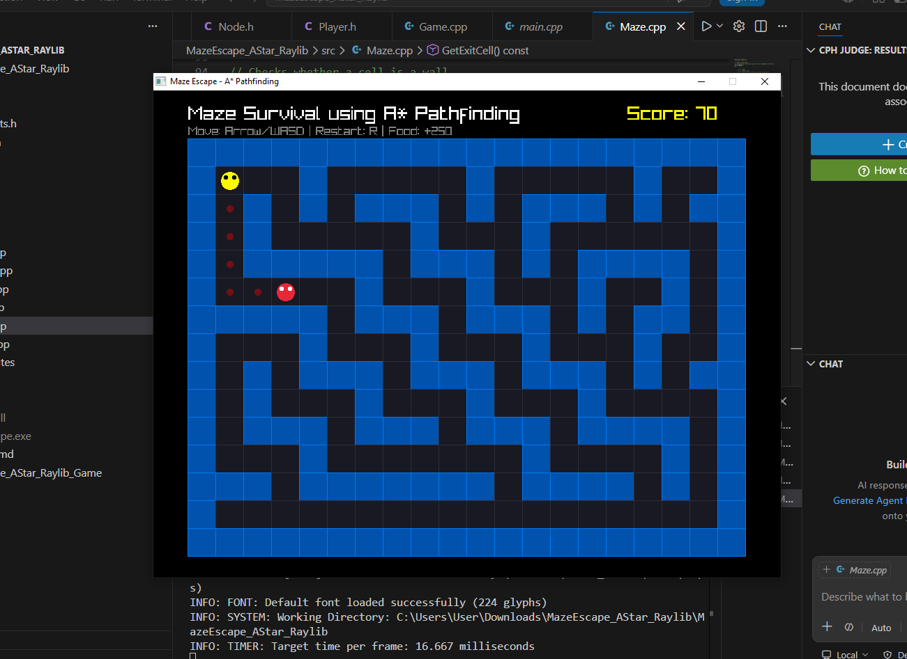

# 🧠 MazeEscape_AStar_Raylib

A simple **2D Maze Survival Game** built using **C++** and **Raylib**.

The project demonstrates:

- Grid-based maze movement
- A* Pathfinding enemy AI
- Multiple enemies
- Random food spawning system
- Score system
- Timer-based gameplay mechanics

---

## 🎮 Gameplay

You are trapped inside a maze.

Your goal:

- Survive enemy pursuit
- Move through the maze
- Collect bonus food for extra score
- Avoid getting caught

Enemies use **A* Pathfinding** to intelligently chase the player.

---

## ✨ Features

✅ Grid-Based Maze System  
✅ Player Movement (Arrow Keys / WASD)  
✅ A* Enemy Pathfinding AI  
✅ Second Enemy Activation System  
✅ Random Food Spawn System  
✅ Food Expiration Timer (4 seconds)  
✅ Score System (+250 food bonus)  
✅ Restart Functionality  
✅ Raylib Graphics Rendering

---

## Demo



## 🕹️ Controls

| Key | Action |
|-----|-----|
| W / ↑ | Move Up |
| S / ↓ | Move Down |
| A / ← | Move Left |
| D / → | Move Right |
| R | Restart Game |

---

## 📁 Project Structure

```txt
MazeEscape_AStar_Raylib/
│
├── include/
│   ├── AStar.h
│   ├── Constants.h
│   ├── Enemy.h
│   ├── Game.h
│   ├── Maze.h
│   ├── Node.h
│   └── Player.h
│
├── src/
│   ├── AStar.cpp
│   ├── Enemy.cpp
│   ├── Game.cpp
│   ├── Maze.cpp
│   ├── Player.cpp
│   └── main.cpp
│
├── MazeEscape.exe
├── README.md
```

---

## ⚙️ Requirements

You need:

- **C++20 Compiler**
- **Raylib**
- **MSYS2 UCRT64** (Recommended for Windows)
- **VS Code** (optional)

---

## 🔧 Build & Run

### Windows (MSYS2)

Compile:

```bash
g++ src/*.cpp -o MazeEscape.exe -Iinclude -lraylib -lopengl32 -lgdi32 -lwinmm
```

Run:

```bash
./MazeEscape.exe
```

---

## 🧩 Technologies Used

- C++
- Raylib
- A* Search Algorithm
- Object Oriented Programming

---

## 📚 Concepts Demonstrated

This project practices:

- OOP Design
- Class Separation
- Game Loop Architecture
- AI Pathfinding
- Grid Systems
- Collision Logic
- Timing Systems
- Random Events

---

## 🚀 Future Improvements

Possible upgrades:

- Procedural Maze Generation
- Powerups
- Difficulty Levels
- Sound Effects
- Animations
- Better Enemy Behaviors
- Save System

---

## 👨‍💻 Author

Built by **Shahriar Kabir Saikat**

GitHub: https://github.com/ShahriarKS
